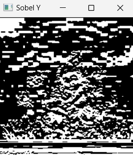

## Edge-Detection
## Aim:
   To perform edge detection using Sobel, Laplacian, and Canny edge detectors.

## Software Required:
Anaconda - Python 3.7

## Algorithm:
## Step1:

Import the necessary modules.
## Step2:

Load the image to operate on.
## Step3:

Convert the image to grayscale image.
## Step4:

Use Sobel operator along x,y and xy directions.
## Step5:

Operate the image using Laplacian operator.
## Step6:

Operate the image using Canny Edge operator.
## Step7:

Show all the operated images output.
## Program:
```
DEVELOPED BY:B.PAVIZHI
REGISTER NUMBER:212221230077
```
## Import the packages
```
import cv2
import numpy as np
import matplotlib.pyplot as plt
```


## Load the image, Convert to grayscale and remove noise
```
image1=cv2.imread ('krishna.jfif') 
gray_image = cv2.cvtColor(image1,cv2.COLOR_BGR2GRAY)

cv2.imshow('Gray',gray_image)
```


## SOBEL EDGE DETECTOR
```
img = cv2.GaussianBlur(gray_image,(3,3),0)
sobelx = cv2.Sobel(gray_image,cv2.CV_64F,1,0,ksize=5)
sobely = cv2.Sobel(gray_image,cv2.CV_64F,0,1,ksize=5)
sobelxy =cv2.Sobel(gray_image,cv2.CV_64F,1,1,ksize=5)
cv2.imshow('Sobel X',sobelx)
cv2.imshow('Sobel Y',sobely)
cv2.imshow('Sobel XY',sobelxy)
```


## LAPLACIAN EDGE DETECTOR
```
laplacian=cv2.Laplacian(img,cv2.CV_64F)
cv2.imshow('Laplacian',laplacian)
```


## CANNY EDGE DETECTOR
```
canny_edges = cv2.Canny(gray_image, 120, 150)
cv2.imshow('Canny Edges',canny_edges)

cv2.waitKey(0)
cv2.destroyAllWindows()
```


## Output:
## GRAYSCALE IMAGE

## SOBEL EDGE DETECTOR




## LAPLACIAN EDGE DETECTOR


## CANNY EDGE DETECTOR

## Result:
Thus the edges are detected using Sobel, Laplacian, and Canny edge detectors.
